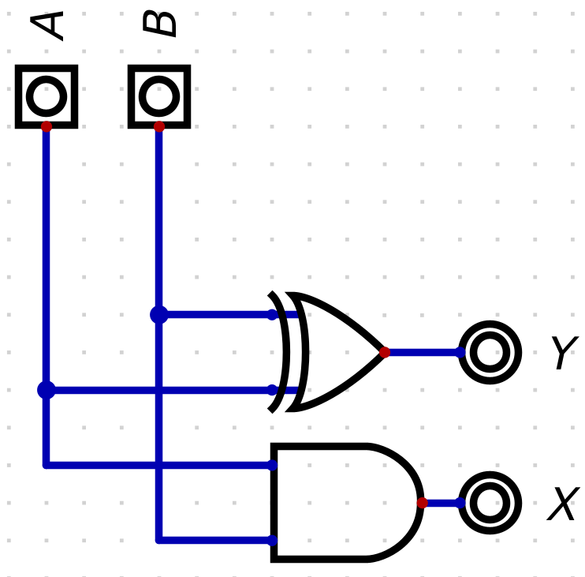

# Sumador-Restador de 4-bits
* [Introducción](#Introducción)
* [Objetivos](#Objetivos)
* [Marco teórico](#Marco-Teórico)
* [Procedimiento](#Procedimiento)
* [Resultados y Análisis](#Resultados-y-Análisis)
* [Discusión](#Discusión)
* [Conclusiones](#Conclusiones)
* [Referencias](#Referencias)

## Resumen

El siguiente informe detalla el diseño y funcionamiento de un Sumador-Restador de 4-bits. Este dispositivo se utiliza comúnmente en aplicaciones digitales para realizar operaciones de suma y resta de números binarios de 4 bits. El diseño y la implementación se basan en principios de lógica digital y utiliza compuertas lógicas para realizar las operaciones requeridas.

## Introducción

Un sumador-restador de 4-bits es un componente esencial en sistemas digitales que requieren la capacidad de realizar operaciones aritméticas con números binarios de 4 bits. Puede sumar o restar dos números binarios de 4 bits y proporcionar un resultado de 4 bits junto con una salida de acarreo (carry-out) que indica si se produce un desbordamiento.

## Objetivos

Elaborar un modelo digital de un sumador-restador de 4 bits 

Describir el funcionamiento de un sumador-restador de 4 bits

Simular el comportamiento de un sumador-restador de 4 bits y sus componentes.

## Marco Teórico

El sumador-restador de 4-bits consta de cuatro etapas, una para cada bit de entrada, y una etapa adicional para manejar el acarreo de entrada (carry-in) en el caso de una operación de resta. Cada etapa opera de la siguiente manera:

1. Etapas de Suma:

Cada etapa de suma toma dos bits de entrada, A y B, y el acarreo de la etapa anterior (Cin).
Utiliza compuertas XOR para calcular la suma (S) y compuertas AND para calcular el acarreo de salida (Cout).
La suma (S) es el resultado de A XOR B XOR Cin.
El acarreo de salida (Cout) es el resultado de (A AND B) OR ((A XOR B) AND Cin).

2. Etapas de Resta:

Cada etapa de resta también toma dos bits de entrada, A y B, y el acarreo de la etapa anterior (Cin).
Utiliza compuertas XOR para calcular la diferencia (D) y compuertas AND para calcular el acarreo de salida (Cout).
La diferencia (D) es el resultado de A XOR B XOR Cin.
El acarreo de salida (Cout) es el resultado de (A AND B') OR ((A XOR B') AND Cin), donde B' es la negación de B.

## Procedimiento
En primer lugar se construye el semisumador el cual utiliza una compuerta XOR para emitir la suma binaria y una compuerta AND para emitir el acarreo de salida (Carry Out).

    
Con dos módulos semisumadores se construye un sumador de un bit, el cual difiere del semisumador por la incorporación de un acarreo de entrada (Carry In) el cual abarca todas las entradas posibles y permite la implementación del módulo en sumas más grandes.

    

Con cuatro módulos sumadores se construye un sumador de 4 bits, teniendo en cuenta que la suma se realiza bit a bit y que el acarreo de salida del bit menos significativo será el acarreo de entrada del siguiente bit, lo cual se repite sucesivamente hasta llegar al bit más significativo.
    

Para la resta se realiza un módulo que transforme el númmero de 4 bits a complemento a dos, cuando el bit de signo así lo indique, para ello se usan compuertas XOR que niegan los bits cuando el bit de signo es uno, pero los dejan iguales cuando es cero, una vez se hayan negado, se procede a efectuar la suma de 1 con el mismo bit de signo.
    

Finalmente, para terminar de construir el sumador-restador de 4 bits, se incorporan los módulos de complemento a 2 para cada entrada antes de pasarlas por el sumador de 4 bits, a su vez, a la salida del sumador se coloca otro módulo de complemento para facilitar la lectura del resultado final, en cuanto al acarreo del resultado, se ubicaron una serie de multiplexores que habilitan o deshabilitan el acarreo de salida del sumador de 4 bits dependiendo si los signos de los entradas son iguales o son diferentes
    

## Resultados y Análisis
Estos fueron los resultados de las simulaciones hechas en gtkwave para cada uno de los componentes del sumador-restador de  4 bits: 

    

    

    

    

## Discusión

## Conclusiones

El sumador-restador de 4-bits es una unidad fundamental en la aritmética binaria utilizada en la mayoría de los sistemas digitales. Su diseño se basa en principios de lógica digital y utiliza compuertas XOR, AND y OR para realizar operaciones aritméticas de suma y resta. Es esencial comprender su funcionamiento para diseñar y trabajar con sistemas digitales que requieran operaciones binarias de 4 bits.

