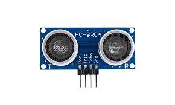
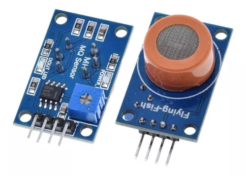
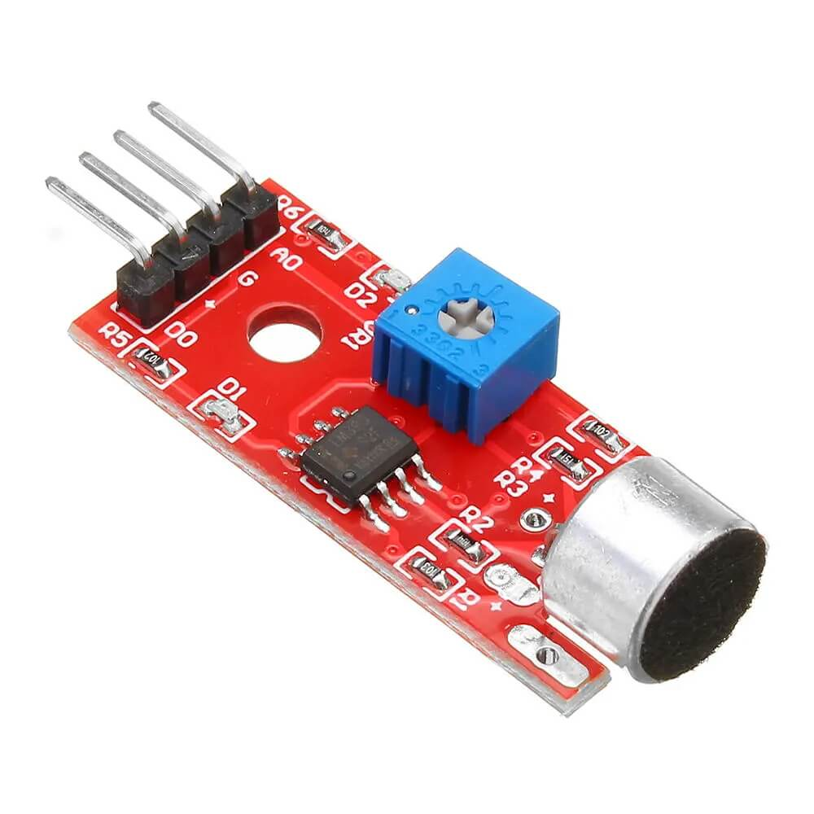
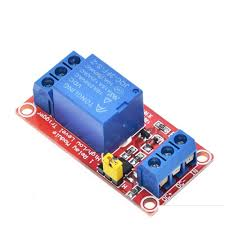
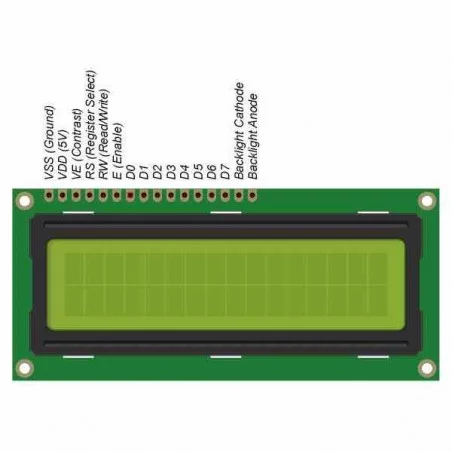
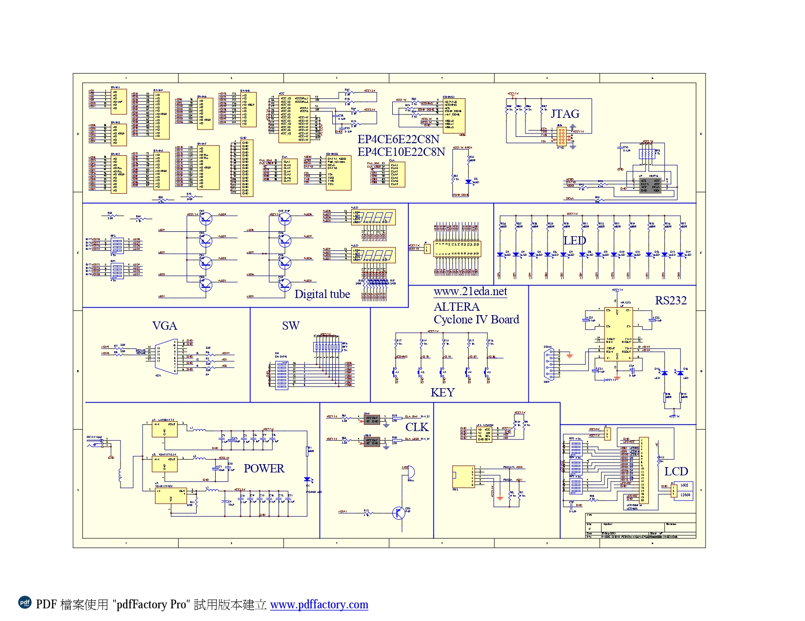

<strong> Laboratorio Electrónica Digital I<strong> 

  
<strong> Proyecto Final: Sistema de Alcoholímetro <strong>  

  
<strong> Samuel Alejandro Cruz Saavedra<strong> 

  
<strong> David Santiago Nalges Barajas <strong> 

  
<strong> Santiago Alejandro Ochoa Quesada <strong>  

  
<strong> Profesor: Diego Alexander Tibaduiza Burgos <strong>  

<strong> Materia: Electrónica Digital I <strong> 

<strong>Universidad Nacional de Colombia<strong> 

<strong>Bogotá D.C.<strong> 

<strong>Facultad de Ingeniería<strong> 

<strong>2023<strong> 

<strong>Proyecto de Electrónica Digital 1.<strong>

  
## Tabla de Contenidos

1. [Planteamiento del problema](#Planteamiento-del-problema)
2. [Presupuesto](#Presupuesto)
3. [Esquemas](#Esquemas)
4. [Marco teórico](#Marco-teórico).

## Planteamiento-del-problema

## Presupuesto

| Elemento                             | Precio      |
| ------------------------------------ | ----------- |
| FPGA                                 | \$679.058   |
| Sensor MQ3| \$13.000 |
| Breadboard                      | \$58.806 |
| Breadboard jumper wires           | \$23.043  |
| LCD i2c                    | \$19.000     |
| Relex          | \$45.225    |
| Sensor HC-SR04            | \$14.000    |
| **Total**                            | **\$ 852.132** |

## Esquemas

## Marco-Teórico

a. **Sensor ultrasónico HC-SR04 (SEN-15569)**

Este es el sensor de alcance ultrasónico HC-SR04. Es un sensor que proporciona una funcionalidad de medición sin contacto de 2 cm a 400 cm con una precisión de alcance que puede alcanzar hasta 3 mm. Solo hay cuatro pines en el HC-SR04: VCC (alimentación), Trig (disparador), Echo (recepción) y GND (tierra). Trabaja alrededor de los 40 kHz y tiene un ángulo eficaz de observación <15°.[2]
En el proyecto se impremento de forma que detectara un rango de distancia para poder verificar que si es la persona que esta conduciendo la que hace la prueba de alcohol, para utilizar este sensor se creo 1 pulso de 10us por medio de un contador que es salida del Trig, luego el sensor manda 8 pulsos de 40khz y el tiempo en que vuelven dichos pulsos por el Echo este se activa logrando asi poder lograr contar la duracion en que el Echo estuvo en 1 se obtiene la distancia utilizando la fisica dado que v=d/t y conociendo la frecuencia de funciona miento de la FPGA para cada ciclo de reloj que en nuestro caso fue de 50Mhz.

    

**Sensor MQ3**

El sensor MQ-3 es un sensor de gas semiconductor que se utiliza comúnmente para detectar concentraciones de gas en el aire. Este sensor es particularmente conocido por su capacidad para detectar gases inflamables y vapores de alcohol con buena sensibilidad que para nuestro caso es el alcoholímetro. El sensor MQ-3 utiliza un elemento de detección semiconductor que cambia su resistencia eléctrica en respuesta a la presencia de determinados gases. Este cambio en la resistencia se debe a la adsorción de gas en la superficie del material semiconductor. Antes de su uso, el sensor requiere un período de calentamiento para alcanzar una temperatura operativa estable. Este calentamiento es esencial para que el sensor funcione de manera efectiva. Cuenta con 4 pines  VCC (alimentación), A0(salida analogica), D0 (salida digital logica negativa) y GND (tierra), Es importante recalibrar el sensor MQ-3 en intervalos regulares, ya que la sensibilidad puede cambiar con el tiempo. La calibración implica exponer el sensor a una concentración conocida de gas de referencia y ajustar el circuito para que refleje con precisión esa concentración en este caso tuvimos que hacerlo de manera experimental ya que es muy complicado tener una medicion especifica conocida y el datasheet las especifiones ambientales son dificiles de controlar para algo demasiado preciso.

    

**Sensor de audio**
tiene un Voltaje de operacion de 3,3/ 5 Vcc con una respuesta en frecuencia: 50 – 20,000 Hz y una sensibilidad: 48-66 dB su Impedancia es 2,200 Ohms  consiste en el funcionamiento de un detector de ondas sonoras, dichas ondas son recibidas en forma de energía y son enviadas mediante señal eléctrica hacia un aparato receptor/codificador. La salida del módulo es dual, en donde por un lado se tiene una señal analógica corresponde a una señal de tensión que va desde los 0 a 5 volts, y por otro lado una salida digital de 2 estados (0 o 1 lógico) según un umbral establecido mediante potenciometro

    

**Rele**

Un relé es un interruptor electromagnético que se utiliza para controlar circuitos eléctricos mediante la aplicación de una pequeña corriente en una bobina, lo que genera un campo magnético que atrae o repele un interruptor mecánico llamado contacto. En el proyecto lo utilizamos como salida para bloquear el encendido del vehiculo si detecta que esta en estado de embriaguez  el conductor

    

**LCD 16x2**

Un LCD (Liquid Crystal Display o pantalla de cristal líquido) 16x2 es un tipo de pantalla que consiste en 16 caracteres por línea y 2 líneas. El controlador tiene una serie de pines que se conectan a la pantalla LCD. Estos pines se utilizan para enviar datos, controlar el encendido y apagado de la pantalla y realizar otras funciones.

El controlador funciona mediante el envío de comandos a la pantalla LCD. Estos comandos indican a la pantalla qué hacer, como mostrar un carácter, mover el cursor o borrar la pantalla.

Para mostrar un carácter, el controlador envía el código ASCII del carácter a la pantalla LCD. El código ASCII es un número que representa cada carácter. Por ejemplo, el código ASCII para la letra "A" es 41 en Hexadecimal.

El controlador también envía un comando para indicar a la pantalla LCD dónde mostrar el carácter. Este comando indica la fila y la columna en la que se mostrará el carácter.

Para mover el cursor, el controlador envía un comando que indica a la pantalla LCD a qué posición debe moverse el cursor. El cursor es un puntero que indica la posición actual en la pantalla.

Para borrar la pantalla, el controlador envía un comando que indica a la pantalla LCD que borre todos los caracteres de la pantalla.

Esto se logro en la FPGA gracias a una maquina de estados y una serie de modulos que realizan todas estas operaciones para tener una interaccion con el usuario del estado en el que se encuentra el sistema.

    

**FPGA Altera Cyclone IV**
Tiene una frecuencia de 50Mhz y es un dispositivo lógico programable desarrollado por Altera (ahora parte de Intel) que pertenece a la serie Cyclone IV de FPGAs. Se tiene que instalar una version de Quartus para programarla https://github.com/johnnycubides/digital-electronic-1-101/blob/main/installTools/quartus.md

    

## Simulaciones

##Referencias 
[1] https://www.sparkfun.com/datasheets/Sensors/MQ-3.pdf
[2] “Ultrasonic Ranging Module HC - SR04”. sparkfun.com/. Accedido el 13 de noviembre de 2023. [En línea]. Disponible: https://cdn.sparkfun.com/datasheets/Sensors/Proximity/HCSR04.pdf
[3] https://www.sparkfun.com/datasheets/Sensors/MQ-3.pdf
[4] https://pdf1.alldatasheet.com/datasheet-pdf/view/1138845/ETC2/KY-038.html
[5] https://components101.com/switches/5v-single-channel-relay-module-pinout-features-applications-working-datasheet
[6] https://circuitdigest.com/article/16x2-lcd-display-module-pinout-datasheet
[7]
